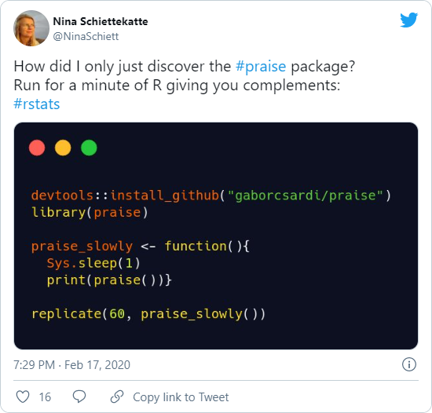

Feeling like you need a shot of self-esteem? Install `praise` and run it until you're ready to take on the world again!

Programming is a challenging task and sometimes we need a little encouragement 💌

# Installation
Install the package using composer:
```shell
composer require bowyer/praise 
```

# Usage
You can use the package two ways

```php
<?php

use bowyer\praise\Praise;

$praise = new Praise();
$praise->say(); // "You are awesome!"
$praise->say("Your code is {{adjective}}!"); // "Your code is superb!"

Praise::praise(); // "You are awesome!"
Praise::praise("{{Adjective}} work {{exclamation}}! {{smiley}}"); // "Superb work ahh! :-)
```

## Templating syntax
Placeholders match the file names in the `data` directory, and are surrounded by `{{` and `}}`. The placeholder will be replaced with a random word from that file.

If you write a placeholder in uppercase (e.g. `{{ADVERB}}`) the word will be output in uppercase.

If you uppercase the first character of a placeholder (e.g. `{{Created}}`) the first character of the word will be output in uppercase.  

# Feedback for R praise





# Credits
This is (so far) a direct port of the superb R package [praise](https://github.com/rladies/praise), © Gabor Csardi with the main wordlist based on work © [Sindre Sorhus](https://github.com/sindresorhus/superb/blob/main/words.json) and others. Both projects are released under the MIT license.